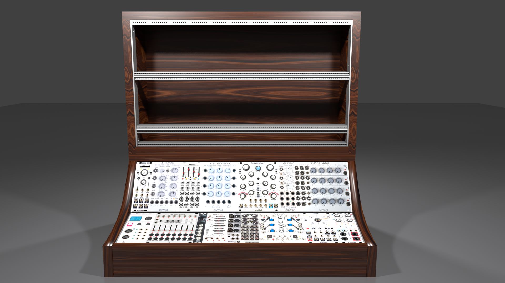
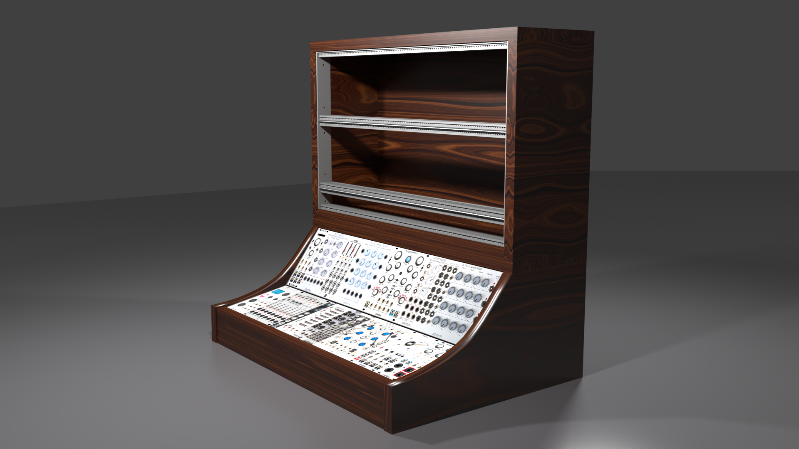
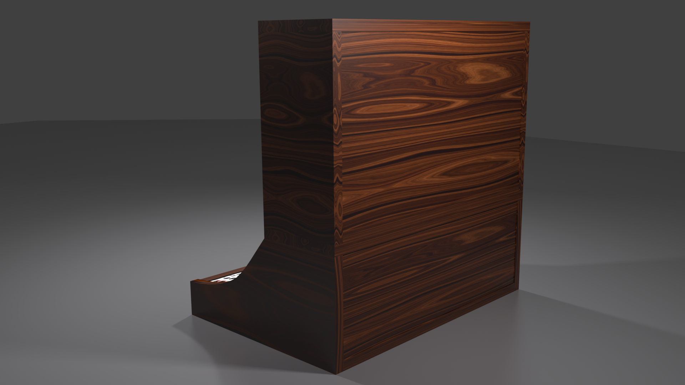

# EurorackCase

This project contains the designs and technical details to build a Eurorack case with 5 x 104 HP.

Get the rails [here][1] and threaded strips [here][2]. You need 2x 104HP(528,32mm) per row.

Watch the related [video] on Youtube for a detailed tutorial.

[1]: https://gie-tec.de/produkt/19-zoll-traegerprofil1/
[2]: https://gie-tec.de/produkt/gewindestreifen/
[video]: https://youtu.be/7tzhh7atj4o